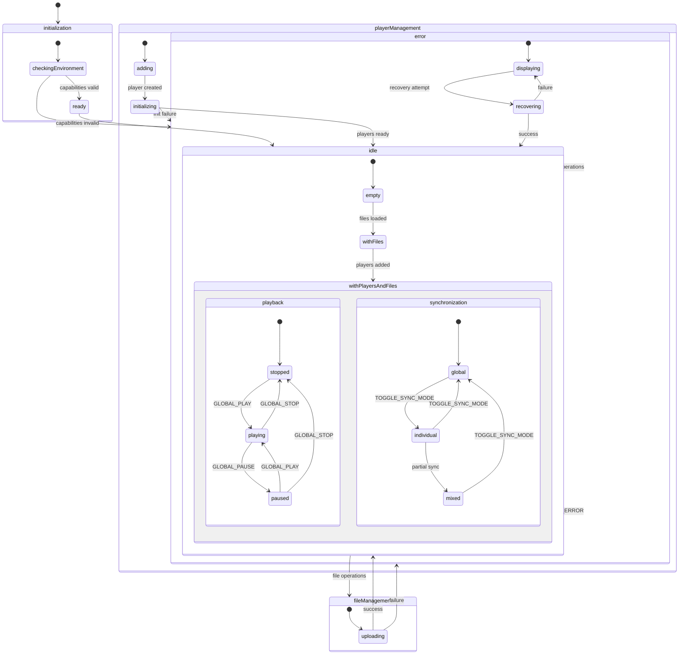
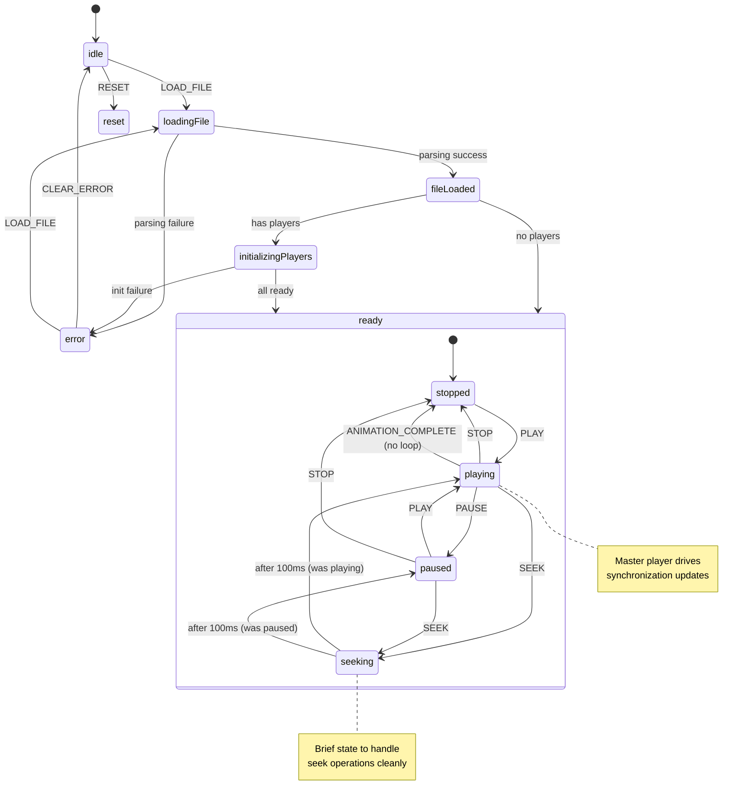
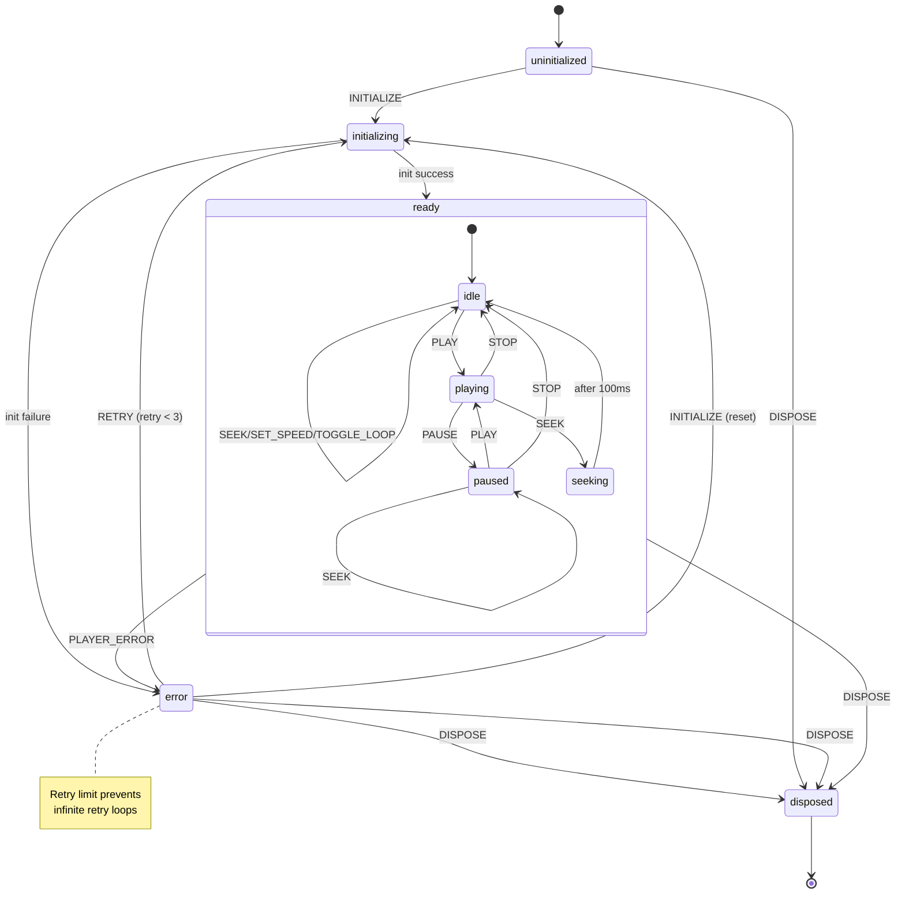
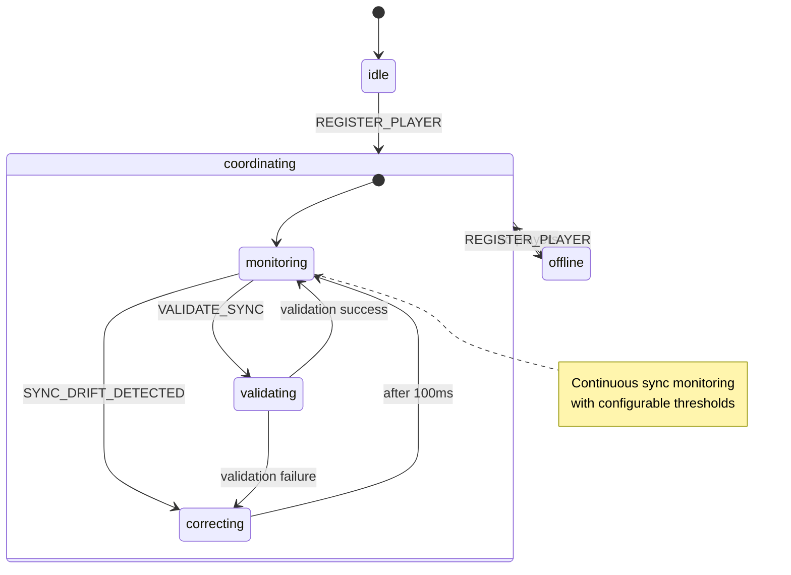
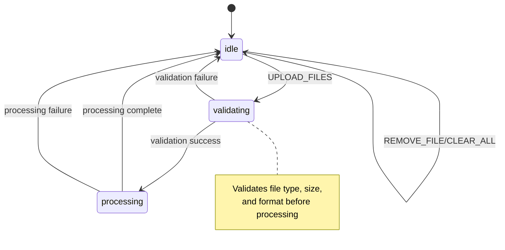

# Architecture Decision Record (ADR)

## Table of Contents

1. [Overview](#overview)
2. [State Machine Architecture](#state-machine-architecture)
3. [Decision Records](#decision-records)
4. [State Machine Diagrams](#state-machine-diagrams)
5. [Integration Patterns](#integration-patterns)

## Overview

This document outlines the architectural decisions made for the Lottie Sync Application, with particular focus on the state machine design patterns and rationale behind each choice.

## State Machine Architecture

### Current Implementation Overview

The application uses XState for managing state across multiple Lottie animation players. The current implementation includes:

**Active Machines:**

1. **Enhanced Application Machine** - Main app orchestrator (used in `App.tsx`)
2. **Sync Machine** - Animation synchronization engine (used in `AppSync.tsx`)
3. **Player Machine** - Individual player lifecycle (spawned via hooks)

**Defined but Unused:**

- Sync Coordinator Machine (functionality integrated into Sync Machine)
- File Manager Machine (functionality integrated into Application Machine)

### Design Requirements

1. **Synchronization Complexity**: Managing frame-perfect synchronization across multiple players
2. **Error Recovery**: Basic retry logic and error states (limited implementation)
3. **Performance**: Frame throttling and memory cleanup (basic implementation)
4. **Maintainability**: Clear separation of concerns (partially achieved)

---

## Decision Records

### ADR-001: Hierarchical State Machine Architecture

**Status**: Accepted  
**Date**: 2024  
**Context**: Need to manage complex application state with multiple independent concerns

#### Problem Statement

The application needs to coordinate:

- File upload and validation
- Multiple player instances with different lifecycle states
- Global playback synchronization
- Error handling across all subsystems
- Performance monitoring and optimization

#### Decision

Implement a hierarchical state machine architecture with specialized machines for each concern:

1. **Enhanced Application Machine** - Top-level orchestrator ✅ _Active_
2. **Sync Machine** - Animation synchronization and playback ✅ _Active_
3. **Player Machine** - Individual player lifecycle ✅ _Active_
4. **Sync Coordinator Machine** - Multi-player coordination ⚠️ _Defined but unused_
5. **File Manager Machine** - File operations ⚠️ _Defined but unused_

**Current Reality**: Only 3 of 5 machines are actively used. Sync coordination is built into the Sync Machine, and file management is handled by the Application Machine.

#### Rationale

**Why Hierarchical Design?**

- **Separation of Concerns**: Each machine handles a specific domain
- **Composability**: Machines can be tested and developed independently
- **Scalability**: New features can be added without modifying existing machines
- **Debugging**: State transitions are isolated to specific domains

**Why XState Over Redux/Zustand?**

- **Explicit State Modeling**: States represent real application conditions, not just data
- **Transition Guards**: Complex business logic expressed as guard conditions
- **Actor Model**: Built-in support for spawning and managing child processes
- **Visual Debugging**: State charts provide clear mental model
- **Side Effect Management**: Actions and services provide controlled side effects

#### Consequences

**Positive:**

- Clear boundaries between different application concerns
- Excellent debugging experience with XState DevTools
- Predictable state transitions reduce bugs
- Easy to reason about complex synchronization logic

**Negative:**

- Steeper learning curve for developers unfamiliar with state machines
- Additional abstraction layer adds some overhead
- Requires careful event design to avoid coupling

#### Implementation Details

```typescript
// Hierarchical structure
enhancedApplicationMachine
├── fileManagerMachine (spawned)
├── syncMachine (spawned)
├── playerMachine[] (multiple spawned)
└── syncCoordinatorMachine (spawned)
```

---

### ADR-002: Master-Slave Synchronization Pattern

**Status**: Accepted  
**Date**: 2024  
**Context**: Need frame-perfect synchronization across multiple Lottie players

#### Problem Statement

Achieving frame-perfect synchronization across multiple Lottie players is challenging because:

- Each player has its own rendering loop
- Network latency affects timing
- Browser throttling can cause drift
- RAF callbacks may not be perfectly aligned

#### Decision

Implement a master-slave pattern where:

- One player is designated as the "master" timekeeper
- All other players sync to the master's timeline
- Frame updates are throttled to prevent excessive synchronization overhead

#### Rationale

**Why Master-Slave vs Consensus?**

- **Consistency**: Single source of truth prevents drift
- **Performance**: Reduces synchronization overhead
- **Simplicity**: Easier to reason about than distributed consensus
- **Deterministic**: Master election is predictable

**Why Throttling Frame Updates?**

- **Performance**: Prevents excessive state machine updates
- **Battery Life**: Reduces CPU usage on mobile devices
- **Smoothness**: Avoids visual jitter from over-synchronization

#### Implementation Strategy

```typescript
// In syncMachine.ts
updateFrameFromPlayer: assign({
  currentFrame: ({ event, context }) => {
    const { frame, playerId } = event;
    const now = Date.now();

    // Throttle to 60fps max (16.67ms)
    if (now - context.lastFrameUpdateTime < 16.67) {
      return context.currentFrame;
    }

    // Only accept updates from master player
    const masterPlayerId =
      context.masterPlayerId || context.players.find((p) => p.status === 'ready')?.id;

    if (playerId !== masterPlayerId) {
      return context.currentFrame;
    }

    return frame;
  },
});
```

#### Consequences

**Positive:**

- Consistent frame synchronization across players
- Reduced CPU usage through throttling
- Clear ownership model for timing

**Negative:**

- Master player failure requires failover logic
- Slight latency for slave players
- Dependency on master player performance

---

### ADR-003: Parallel State Design for Independent Concerns

**Status**: Accepted  
**Date**: 2024  
**Context**: Need to manage independent aspects of application state simultaneously

#### Problem Statement

The application needs to track multiple independent state dimensions:

- Playback state (playing, paused, stopped)
- Synchronization mode (global, individual, mixed)
- File management state
- Player management state

Traditional state machines handle these as separate sequential states, leading to state explosion.

#### Decision

Use XState parallel states to model independent concerns that can change simultaneously.

#### Rationale

**Why Parallel States?**

- **State Space Reduction**: Avoids cartesian product explosion
- **Independent Evolution**: Each concern can evolve independently
- **Clear Modeling**: Matches mental model of independent aspects
- **Event Handling**: Events can affect multiple parallel regions

#### Implementation Example

```typescript
// In enhancedApplicationMachine.ts
withPlayersAndFiles: {
  type: 'parallel',
  states: {
    playback: {
      initial: 'stopped',
      states: {
        stopped: { /* ... */ },
        playing: { /* ... */ },
        paused: { /* ... */ }
      }
    },
    synchronization: {
      initial: 'global',
      states: {
        global: { /* ... */ },
        individual: { /* ... */ },
        mixed: { /* ... */ }
      }
    }
  }
}
```

#### Consequences

**Positive:**

- Natural modeling of independent concerns
- Reduced state complexity
- Clear event handling across dimensions

**Negative:**

- Requires careful event design
- Can be confusing for developers new to parallel states

---

### ADR-004: Service-Based Async Operations

**Status**: Accepted  
**Date**: 2024  
**Context**: Need to handle async operations like file loading and player initialization

#### Problem Statement

The application performs several async operations:

- File reading and parsing
- Player initialization
- Animation preprocessing
- Network requests for assets

These operations can fail, take variable time, and need cancellation support.

#### Decision

Use XState services (invoked actors) for all async operations with proper error handling and cancellation.

#### Rationale

**Why Services Over Promises?**

- **Cancellation**: Services can be cancelled when state machine transitions
- **Error Handling**: Structured error handling with onError transitions
- **Progress Updates**: Services can send progress events
- **Integration**: Native integration with state machine lifecycle

#### Implementation Pattern

```typescript
// Service definition
invoke: {
  id: 'loadAnimation',
  src: fromPromise(async ({ input }) => {
    const { file } = input;
    // Async operation with proper error handling
    return await parseLottieFile(file);
  }),
  input: ({ event }) => ({ file: event.file }),
  onDone: {
    target: 'loaded',
    actions: 'setAnimationData'
  },
  onError: {
    target: 'error',
    actions: 'setError'
  }
}
```

#### Consequences

**Positive:**

- Automatic cancellation on state transitions
- Structured error handling
- Progress reporting capability
- Memory leak prevention

**Negative:**

- Additional complexity in service definition
- Learning curve for service patterns

---

### ADR-005: Context Immutability with Assign Actions

**Status**: Accepted  
**Date**: 2024  
**Context**: Need predictable state updates and debugging capabilities

#### Problem Statement

State mutations need to be:

- Predictable and traceable
- Efficient for React rendering
- Debuggable in development
- Type-safe

#### Decision

Use XState's `assign` action exclusively for context updates with immutable patterns.

#### Rationale

**Why Immutable Updates?**

- **React Integration**: Immutable updates trigger proper re-renders
- **Debugging**: Clear history of state changes
- **Predictability**: No unexpected side effects
- **Time Travel**: Enables replay debugging

**Why Assign Actions?**

- **Type Safety**: TypeScript can verify context structure
- **Declarative**: Updates are declared, not imperative
- **Composition**: Multiple assigns can be composed
- **Debugging**: XState DevTools show exact changes

#### Implementation Pattern

```typescript
// Immutable context updates
addPlayer: assign({
  players: ({ context, event }) => {
    const newPlayer = createPlayer(event);
    return [...context.players, newPlayer]; // Immutable update
  },
  lastModified: () => Date.now(),
});
```

#### Consequences

**Positive:**

- Excellent debugging experience
- Predictable React re-renders
- Type safety with TypeScript
- Clear audit trail

**Negative:**

- Memory overhead for large contexts
- Requires immutable update patterns

---

### ADR-006: Error Boundary Integration

**Status**: Accepted  
**Date**: 2024  
**Context**: Need comprehensive error handling across state machines and React components

#### Problem Statement

Errors can occur at multiple levels:

- State machine services (async operations)
- React component rendering
- Player initialization
- File parsing

Need unified error handling strategy.

#### Decision

Implement error states in all state machines with React Error Boundary integration.

#### Rationale

**Why State Machine Error States?**

- **Recovery Logic**: State machines can implement recovery strategies
- **User Feedback**: Errors are part of the user experience
- **Graceful Degradation**: Application continues with reduced functionality

**Why Error Boundaries?**

- **Component Isolation**: Errors in one component don't crash the app
- **Fallback UI**: Provide meaningful error messages
- **Error Reporting**: Centralized error logging

#### Implementation Strategy

```typescript
// State machine error handling
error: {
  initial: 'displaying',
  states: {
    displaying: {
      on: {
        CLEAR_ERROR: { target: 'recovering' },
        RETRY: { target: 'recovering', guard: 'canRetry' }
      }
    },
    recovering: {
      invoke: {
        id: 'recovery',
        src: 'recoveryService',
        onDone: { target: '#machine.idle' },
        onError: { target: 'displaying' }
      }
    }
  }
}
```

#### Consequences

**Positive:**

- Robust error handling at all levels
- Clear recovery pathways
- Good user experience during errors

**Negative:**

- Additional complexity in error state modeling
- Requires careful error boundary placement

---

## State Machine Diagrams

### Enhanced Application Machine

The top-level orchestrator managing application lifecycle and coordination between specialized machines.



**Key Decision**: Hierarchical design with parallel states for independent concerns (playback vs synchronization).

### Sync Machine

Manages animation synchronization and playback control with master-slave coordination.



**Key Decision**: Master-slave pattern with throttled updates for performance and consistency.

### Player Machine

Individual player lifecycle management with robust error handling and retry logic.



**Key Decision**: Automatic retry with limits and explicit disposal for resource management.

### Sync Coordinator Machine

Multi-player synchronization coordination with performance monitoring.



**Key Decision**: Proactive sync monitoring with automatic drift correction.

### File Manager Machine

File upload, validation, and processing with comprehensive error handling.



**Key Decision**: Separate validation and processing phases for better error isolation.

---

## Integration Patterns

### Event-Driven Communication

State machines communicate through well-defined events rather than direct coupling:

```typescript
// Example: Application Machine coordinating with Sync Machine
// Application Machine sends event
syncMachineRef.send({
  type: 'LOAD_FILE',
  file: selectedFile
});

// Sync Machine responds with events
onDone: {
  target: 'ready',
  actions: sendParent({ type: 'SYNC_READY' })
}
```

**Rationale**: Loose coupling enables independent testing and modification.

### Actor Model for Resource Management

Child actors are spawned for specific tasks and automatically cleaned up:

```typescript
// Spawning child machines
spawn(playerMachine, { input: playerConfig, id: playerId });

// Automatic cleanup on parent disposal
onDone: {
  actions: 'cleanupChildActors';
}
```

**Rationale**: Prevents memory leaks and provides clear ownership model.

### Context Sharing Strategies

Machines share state through events rather than shared context:

```typescript
// Instead of shared mutable state
❌ sharedContext.currentFrame = newFrame;

// Use events for state synchronization
✅ send({ type: 'FRAME_UPDATE', frame: newFrame });
```

**Rationale**: Explicit communication makes dependencies clear and testable.

---

## Performance Considerations

### Throttling Strategy

Frame updates are throttled to prevent excessive re-renders:

```typescript
// 60fps throttling
if (now - context.lastFrameUpdateTime < 16.67) {
  return context.currentFrame;
}
```

**Rationale**: Balances smoothness with performance.

### Memory Management

Explicit cleanup prevents memory leaks:

```typescript
// Cleanup blob URLs
if (context.dotLottieSrcUrl) {
  URL.revokeObjectURL(context.dotLottieSrcUrl);
}
```

**Rationale**: Long-running applications need explicit resource management.

### Selective Event Broadcasting

Events are only sent to relevant actors:

```typescript
// Only sync with players in global mode
if (context.syncMode === 'global') {
  context.playerRefs.forEach((playerRef) => {
    playerRef.send(syncEvent);
  });
}
```

**Rationale**: Reduces unnecessary processing and potential side effects.

---

## Testing Strategy

### State Machine Testing

Each machine is tested in isolation with comprehensive coverage:

```typescript
// Test state transitions
test('should transition from idle to playing on PLAY event', () => {
  const nextState = syncMachine.transition('idle', { type: 'PLAY' });
  expect(nextState.value).toBe('playing');
});

// Test guard conditions
test('should only allow play when animation is loaded', () => {
  const state = syncMachine.transition('idle', { type: 'PLAY' });
  expect(state.changed).toBe(false); // Guard prevented transition
});
```

### Integration Testing

End-to-end workflows are tested across multiple machines:

```typescript
test('complete file upload and playback workflow', async () => {
  // 1. Upload file
  // 2. Create player
  // 3. Start playback
  // 4. Verify synchronization
});
```

### Performance Testing

Performance characteristics are validated under load:

```typescript
test('sync performance with multiple players', () => {
  // Create 10 players
  // Measure sync latency
  // Verify frame rate consistency
});
```

**Rationale**: State machines enable comprehensive testing through deterministic behavior and clear interfaces.

---

## Future Considerations

### Scalability

The architecture supports future enhancements:

- **Web Workers**: Services can be moved to Web Workers for better performance
- **Remote Synchronization**: Sync Coordinator can be extended for network sync
- **Plugin Architecture**: New player types can be added without core changes

### Observability

State machines provide excellent observability:

- **State Logging**: All state changes are automatically logged
- **Performance Metrics**: Built-in timing for state transitions
- **Error Tracking**: Comprehensive error state modeling

### Maintainability

The modular design supports long-term maintenance:

- **Clear Boundaries**: Each machine has well-defined responsibilities
- **Independent Evolution**: Machines can be updated independently
- **Documentation**: State charts serve as living documentation

## Current State & Improvement Opportunities

### What's Actually Implemented vs Documented

**Fully Implemented:**

- Enhanced Application Machine with file upload and player management
- Sync Machine with animation loading and basic synchronization
- Player Machine with retry logic and lifecycle management
- Basic error states and recovery mechanisms

**Partially Implemented:**

- Master-slave synchronization (basic implementation without failover)
- Performance throttling (fixed thresholds, no adaptive behavior)
- Resource cleanup (basic disposal, no comprehensive tracking)

**Over-Documented:**

- Sync Coordinator Machine (defined but unused - functionality in Sync Machine)
- File Manager Machine (defined but unused - functionality in Application Machine)
- Advanced error recovery (basic retry only)
- Comprehensive performance monitoring (console logging only)

### Key Improvement Opportunities

1. **Architecture Simplification**
   - Remove unused machines (Sync Coordinator, File Manager)
   - Consolidate dual app architecture (App.tsx vs AppSync.tsx)
   - Clean up dead code and over-abstractions

2. **Production Readiness**
   - Replace console.log with structured logging
   - Add real performance metrics collection
   - Implement comprehensive error tracking
   - Add proper resource monitoring

3. **Enhanced Functionality**
   - Advanced error recovery strategies
   - Adaptive performance optimization
   - Network synchronization capabilities
   - Plugin architecture for extensibility

**See [CURRENT_STATE_AND_IMPROVEMENTS.md](./CURRENT_STATE_AND_IMPROVEMENTS.md) for detailed analysis and migration path.**

This architecture provides a solid foundation for synchronizing multiple Lottie animations, but needs practical refinement based on actual usage patterns rather than theoretical completeness.
