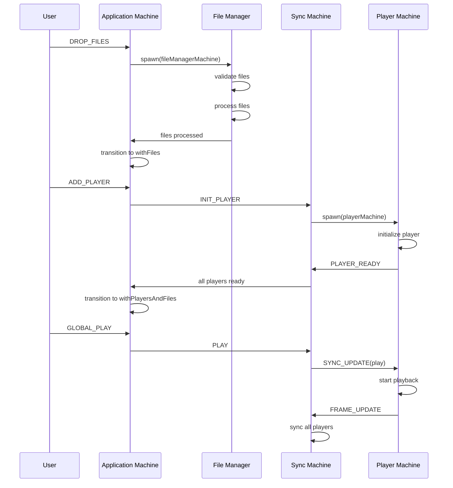
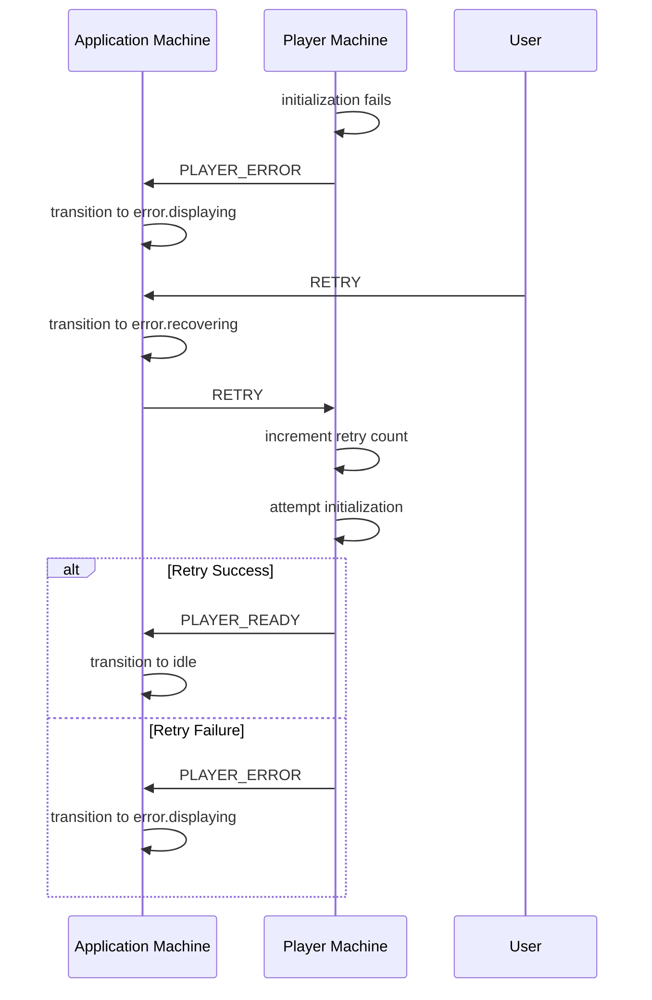
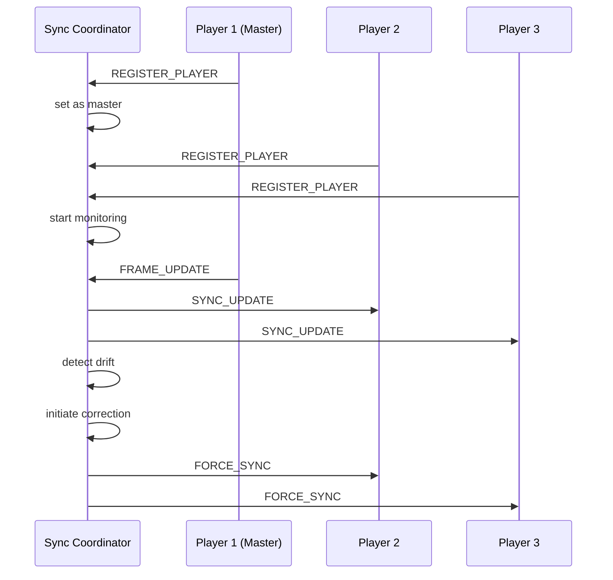

# State Machine Technical Reference

## Table of Contents

1. [Enhanced Application Machine](#enhanced-application-machine)
2. [Sync Machine](#sync-machine)
3. [Player Machine](#player-machine)
4. [Sync Coordinator Machine](#sync-coordinator-machine)
5. [File Manager Machine](#file-manager-machine)
6. [Event Flow Diagrams](#event-flow-diagrams)
7. [Integration Patterns](#integration-patterns)

---

## Enhanced Application Machine

### States and Transitions

#### State Hierarchy

```
enhancedApplication
├── initialization
│   ├── checkingEnvironment
│   └── ready
├── idle
│   ├── empty
│   ├── withFiles
│   └── withPlayersAndFiles (parallel)
│       ├── playback
│       │   ├── stopped
│       │   ├── playing
│       │   └── paused
│       └── synchronization
│           ├── global
│           ├── individual
│           └── mixed
├── fileManagement
│   └── uploading
│       ├── single
│       └── multiple
├── playerManagement
│   ├── adding
│   └── initializing
└── error
    ├── displaying
    └── recovering
```

#### Event Catalog

| Event              | Source        | Target States                               | Guards               | Actions                                        |
| ------------------ | ------------- | ------------------------------------------- | -------------------- | ---------------------------------------------- |
| `UPLOAD_FILE`      | User/UI       | `fileManagement.uploading.single`           | -                    | `assignInitializationData`                     |
| `DROP_FILES`       | User/UI       | `fileManagement.uploading.multiple`         | `hasValidDragFiles`  | `assignInitializationData`                     |
| `ADD_PLAYER`       | User/UI       | `playerManagement.adding`                   | `canAddPlayer`       | `addPlayer`                                    |
| `GLOBAL_PLAY`      | User/UI       | `idle.withPlayersAndFiles.playback.playing` | `hasFilesAndPlayers` | `globalPlay`, `syncAllPlayers`                 |
| `GLOBAL_PAUSE`     | User/UI       | `idle.withPlayersAndFiles.playback.paused`  | -                    | `globalPause`                                  |
| `GLOBAL_STOP`      | User/UI       | `idle.withPlayersAndFiles.playback.stopped` | -                    | `globalStop`                                   |
| `TOGGLE_SYNC_MODE` | User/UI       | Various sync states                         | -                    | `toggleSyncMode`                               |
| `SELECT_FILE`      | User/UI       | Current state                               | `hasFiles`           | `selectFile`, `transitionToAppropriateState`   |
| `REMOVE_FILE`      | User/UI       | Current state                               | `canRemoveFile`      | `removeFile`, `transitionToAppropriateState`   |
| `REMOVE_PLAYER`    | User/UI       | Current state                               | `canRemovePlayer`    | `removePlayer`, `transitionToAppropriateState` |
| `PLAYER_READY`     | Child Machine | Current state                               | -                    | `markPlayerReady`                              |
| `PLAYER_ERROR`     | Child Machine | `error`                                     | -                    | `markPlayerError`                              |
| `CLEAR_ERROR`      | User/UI       | `error.recovering`                          | -                    | `clearError`                                   |
| `RETRY`            | User/UI       | `error.recovering`                          | `canRetry`           | -                                              |

#### Guard Conditions

```typescript
guards: {
  hasValidFile: ({ context }) => context.selectedFile !== null,
  hasFiles: ({ context }) => context.files.length > 0,
  hasPlayers: ({ context }) => context.players.length > 0,
  canAddPlayer: ({ context }) => context.players.length < 10,
  hasFilesAndPlayers: ({ context }) =>
    context.files.length > 0 && context.players.length > 0,
  canRemoveFile: ({ context, event }) => {
    const fileId = event.fileId;
    return context.files.some(f => f.id === fileId);
  },
  canRemovePlayer: ({ context, event }) => {
    const playerId = event.playerId;
    return context.players.some(p => p.id === playerId);
  },
  hasValidDragFiles: ({ event }) => {
    const files = event.files;
    return Array.isArray(files) &&
           files.length > 0 &&
           files.every(file => file instanceof File);
  },
  canRetry: ({ context }) => {
    return context.error !== null &&
           !context.error.includes('validation');
  }
}
```

#### Context Structure

```typescript
interface ApplicationContext {
  files: LottieFile[];
  selectedFile: LottieFile | null;
  players: PlayerInstance[];
  globalControls: {
    isPlaying: boolean;
    isPaused: boolean;
    currentFrame: number;
    totalFrames: number;
    currentTime: number;
    duration: number;
    speed: number;
    loop: boolean;
    synchronizationMode: 'global' | 'individual' | 'mixed';
  };
  performanceMetrics: PerformanceMetric[];
  error: string | null;
  dragActive: boolean;
}
```

---

## Sync Machine

### States and Transitions

#### State Hierarchy

```
syncMachine
├── idle
├── loadingFile
├── fileLoaded
├── initializingPlayers
├── ready (compound)
│   ├── stopped
│   ├── playing
│   ├── paused
│   └── seeking
└── error
```

#### Event Catalog

| Event                | Source    | Target States                         | Guards                 | Actions                           |
| -------------------- | --------- | ------------------------------------- | ---------------------- | --------------------------------- |
| `LOAD_FILE`          | Parent/UI | `loadingFile`                         | -                      | Store file reference              |
| `INIT_PLAYER`        | Parent    | `initializingPlayers` (if fileLoaded) | -                      | `addPlayer`                       |
| `PLAYER_READY`       | Child     | Current state                         | -                      | `markPlayerReady`                 |
| `PLAYER_ERROR`       | Child     | Current state                         | -                      | `markPlayerError`                 |
| `PLAY`               | Parent/UI | `ready.playing`                       | `hasAnimation`         | `startPlayback`, `syncAllPlayers` |
| `PAUSE`              | Parent/UI | `ready.paused`                        | -                      | `pausePlayback`                   |
| `STOP`               | Parent/UI | `ready.stopped`                       | -                      | `stopPlayback`                    |
| `SEEK`               | Parent/UI | `ready.seeking`                       | -                      | `seekToFrame`                     |
| `SET_SPEED`          | Parent/UI | Current state                         | -                      | `setSpeed`, `syncAllPlayers`      |
| `TOGGLE_LOOP`        | Parent/UI | Current state                         | -                      | `toggleLoop`, `syncAllPlayers`    |
| `FRAME_UPDATE`       | Player    | Current state                         | `isFromMasterPlayer`   | `updateFrameFromPlayer`           |
| `ANIMATION_COMPLETE` | Player    | `ready.stopped` or continue           | `shouldStopOnComplete` | `handleAnimationComplete`         |
| `CLEAR_ERROR`        | Parent/UI | `idle`                                | -                      | `clearError`                      |
| `RESET`              | Parent    | `idle`                                | -                      | `resetMachine`                    |

#### Critical State Transitions

**File Loading Flow:**

```
idle → LOAD_FILE → loadingFile → [service resolves] → fileLoaded
```

**Player Initialization Flow:**

```
fileLoaded → INIT_PLAYER → initializingPlayers → [all players ready] → ready
```

**Playback Control Flow:**

```
ready.stopped → PLAY → ready.playing
ready.playing → PAUSE → ready.paused
ready.playing → SEEK → ready.seeking → [100ms delay] → ready.playing/paused
```

#### Synchronization Logic

```typescript
// Master player selection and frame updates
updateFrameFromPlayer: assign({
  currentFrame: ({ event, context }) => {
    const { frame, playerId } = event;
    const now = Date.now();

    // Throttle updates to 60fps max
    if (now - context.lastFrameUpdateTime < 16.67) {
      return context.currentFrame;
    }

    // Establish master player
    const masterPlayerId =
      context.masterPlayerId || context.players.find((p) => p.status === 'ready')?.id || null;

    // Only accept updates from master
    if (playerId !== masterPlayerId) {
      return context.currentFrame;
    }

    // Smooth frame updates
    if (Math.abs(frame - context.currentFrame) >= 0.5) {
      return frame;
    }

    return context.currentFrame;
  },
  masterPlayerId: ({ context }) => {
    return context.masterPlayerId || context.players.find((p) => p.status === 'ready')?.id || null;
  },
  lastFrameUpdateTime: () => Date.now(),
});
```

---

## Player Machine

### States and Transitions

#### State Hierarchy

```
player
├── uninitialized
├── initializing
├── ready (compound)
│   ├── idle
│   ├── playing
│   ├── paused
│   └── seeking
├── error
└── disposed (final)
```

#### Event Catalog

| Event           | Source      | Target States              | Guards                  | Actions                     |
| --------------- | ----------- | -------------------------- | ----------------------- | --------------------------- |
| `INITIALIZE`    | Parent      | `initializing`             | -                       | `assignInitializationData`  |
| `PLAY`          | Sync/Parent | `ready.playing`            | -                       | `play`, invoke frameUpdater |
| `PAUSE`         | Sync/Parent | `ready.paused`             | -                       | `pause`                     |
| `STOP`          | Sync/Parent | `ready.idle`               | -                       | `stop`                      |
| `SEEK`          | Sync/Parent | `ready.seeking` or current | -                       | `seek`                      |
| `SET_SPEED`     | Sync/Parent | Current state              | -                       | `setSpeed`                  |
| `TOGGLE_LOOP`   | Sync/Parent | Current state              | -                       | `toggleLoop`                |
| `SYNC_UPDATE`   | Coordinator | Current state              | `syncMode === 'global'` | `handleSyncUpdate`          |
| `SET_SYNC_MODE` | Coordinator | Current state              | -                       | `setSyncMode`               |
| `FRAME_UPDATE`  | Internal    | Current state              | -                       | `updateFrameData`           |
| `PLAYER_ERROR`  | Internal    | `error`                    | -                       | `setError`                  |
| `RETRY`         | User/Parent | `initializing`             | `retryCount < 3`        | `incrementRetryCount`       |
| `DISPOSE`       | Parent      | `disposed`                 | -                       | `disposePlayer`             |

#### Player Lifecycle Management

```typescript
// Player initialization service
initializePlayer: fromPromise(async ({ input }) => {
  const { container, file, config } = input;

  if (!container || !file) {
    throw new Error('Container and file required');
  }

  const { DotLottie } = await import('@lottiefiles/dotlottie-web');
  const instance = new DotLottie({
    canvas:
      container.querySelector('canvas') || container.appendChild(document.createElement('canvas')),
    src: file.url,
    autoplay: config.autoplay,
    loop: config.loop,
    speed: config.speed,
  });

  await new Promise((resolve) => {
    instance.addEventListener('ready', resolve);
  });

  return { instance, config, file };
});
```

#### Error Handling and Retry Logic

```typescript
// Retry mechanism with exponential backoff
error: {
  on: {
    RETRY: {
      target: 'initializing',
      actions: 'incrementRetryCount',
      guard: ({ context }) => context.retryCount < 3
    },
    INITIALIZE: {
      target: 'initializing',
      actions: ['resetRetryCount', 'assignInitializationData']
    },
    DISPOSE: {
      target: 'disposed'
    }
  }
}
```

---

## Sync Coordinator Machine

### States and Transitions

#### State Hierarchy

```
syncCoordinator
├── idle
├── coordinating (compound)
│   ├── monitoring
│   ├── validating
│   └── correcting
└── offline
```

#### Event Catalog

| Event                     | Source          | Target States             | Guards | Actions                                        |
| ------------------------- | --------------- | ------------------------- | ------ | ---------------------------------------------- |
| `REGISTER_PLAYER`         | Player          | `coordinating`            | -      | `registerPlayer`                               |
| `UNREGISTER_PLAYER`       | Player          | Current/offline           | -      | `unregisterPlayer`                             |
| `SET_MASTER`              | Parent/UI       | Current state             | -      | `setMaster`                                    |
| `SET_SYNC_MODE`           | Parent/UI       | Current state             | -      | `setSyncMode`, `notifyPlayersOfSyncModeChange` |
| `BROADCAST_EVENT`         | Parent          | Current state             | -      | `broadcastEvent`                               |
| `VALIDATE_SYNC`           | Monitor Service | `coordinating.validating` | -      | -                                              |
| `SYNC_DRIFT_DETECTED`     | Monitor Service | `coordinating.correcting` | -      | `logSyncDrift`                                 |
| `FORCE_SYNC`              | Parent/UI       | Current state             | -      | `forceSync`                                    |
| `UPDATE_PERFORMANCE_MODE` | Parent/UI       | Current state             | -      | `updatePerformanceMode`                        |

#### Synchronization Services

```typescript
// Continuous sync monitoring
syncMonitorService: ({ context }) => (callback) => {
  const monitorInterval = setInterval(() => {
    if (context.syncMode === 'global' && context.playerRefs.size > 1) {
      callback({ type: 'VALIDATE_SYNC' });
    }
  }, context.syncThreshold);

  return () => clearInterval(monitorInterval);
},

// Sync validation
validateSyncService: async ({ context }) => {
  const players = Array.from(context.playerRefs.entries());

  if (players.length < 2) {
    return { inSync: true, maxDrift: 0 };
  }

  // Check frame drift across players
  let maxDrift = 0;
  let inSync = true;

  // Validation logic here...

  return { inSync, maxDrift };
}
```

---

## File Manager Machine

### States and Transitions

#### State Hierarchy

```
fileManager
├── idle
├── validating
├── processing
└── error
```

#### Event Catalog

| Event          | Source | Target States | Guards | Actions             |
| -------------- | ------ | ------------- | ------ | ------------------- |
| `UPLOAD_FILES` | UI     | `validating`  | -      | `prepareValidation` |
| `REMOVE_FILE`  | UI     | Current state | -      | `removeFile`        |
| `CLEAR_ALL`    | UI     | Current state | -      | `clearAllFiles`     |
| `CLEAR_ERROR`  | UI     | `idle`        | -      | -                   |

#### File Processing Pipeline

```typescript
// File validation service
validateFiles: fromPromise(async ({ input }) => {
  const { files, context } = input;
  const results = [];

  for (const file of files) {
    // Size validation
    if (file.size > context.maxFileSize) {
      results.push({
        file,
        valid: false,
        error: `File size exceeds ${context.maxFileSize / (1024 * 1024)}MB`,
      });
      continue;
    }

    // Type validation
    const hasValidExtension = context.supportedTypes.some((type) =>
      file.name.toLowerCase().endsWith(type)
    );

    if (!hasValidExtension) {
      results.push({
        file,
        valid: false,
        error: `Unsupported type. Supported: ${context.supportedTypes.join(', ')}`,
      });
      continue;
    }

    results.push({ file, valid: true });
  }

  return results;
});
```

---

## Event Flow Diagrams

### File Upload to Playback Flow



### Error Recovery Flow



### Synchronization Coordination Flow



---

## Integration Patterns

### Parent-Child Communication

```typescript
// Parent spawning child with input
const playerRef = spawn(playerMachine, {
  input: {
    container: containerElement,
    file: selectedFile,
    config: playerConfig,
  },
  id: `player-${playerId}`,
});

// Child sending events to parent
// In child machine:
actions: {
  notifyParent: sendParent({
    type: 'PLAYER_READY',
    playerId: context.config.id,
  });
}
```

### Event Broadcasting Pattern

```typescript
// Coordinator broadcasting to multiple children
broadcastEvent: assign({
  syncEvents: ({ context, event }) => {
    const syncEvent = event.event;

    if (context.syncMode === 'global') {
      context.playerRefs.forEach((playerRef, playerId) => {
        try {
          playerRef.send({
            type: 'SYNC_UPDATE',
            event: syncEvent,
          });
        } catch (error) {
          console.error(`Failed to sync with player ${playerId}:`, error);
        }
      });
    }

    return [...context.syncEvents, syncEvent].slice(-50);
  },
});
```

### Service Cleanup Pattern

```typescript
// Automatic cleanup on state exit
onExit: {
  actions: 'cleanupResources'
},

cleanupResources: ({ context }) => {
  // Cleanup blob URLs
  if (context.dotLottieSrcUrl) {
    URL.revokeObjectURL(context.dotLottieSrcUrl);
  }

  // Cleanup asset URLs
  if (context.assetsMap) {
    Object.values(context.assetsMap).forEach(url => {
      URL.revokeObjectURL(url);
    });
  }

  // Dispose player instances
  context.players.forEach(player => {
    if (player.instance && player.instance.destroy) {
      player.instance.destroy();
    }
  });
}
```

This technical reference provides comprehensive documentation of all state machines, their transitions, events, and integration patterns. The combination of state diagrams, event catalogs, and code examples makes it easy to understand both the high-level architecture and implementation details.
