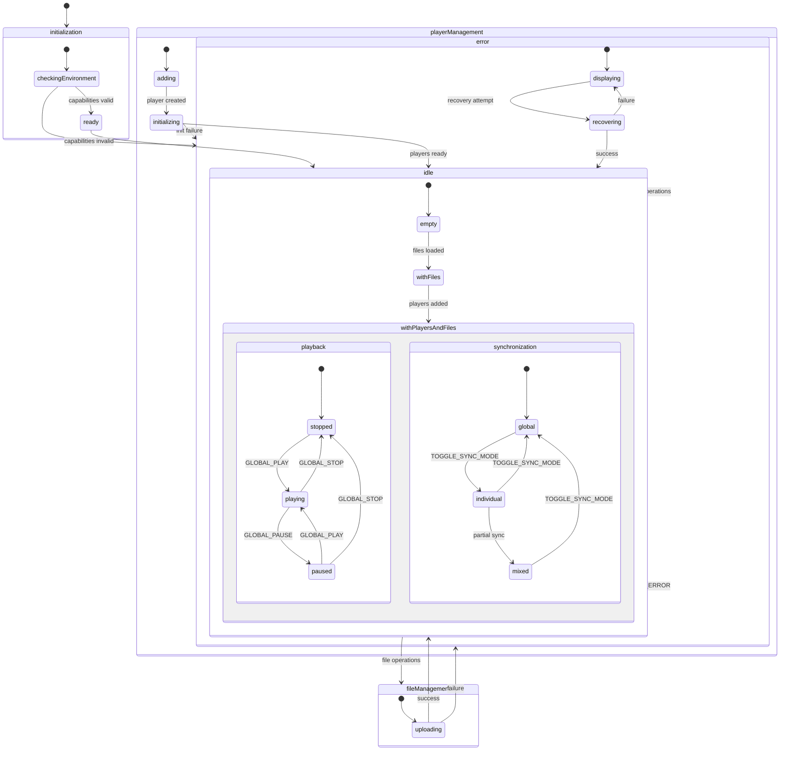
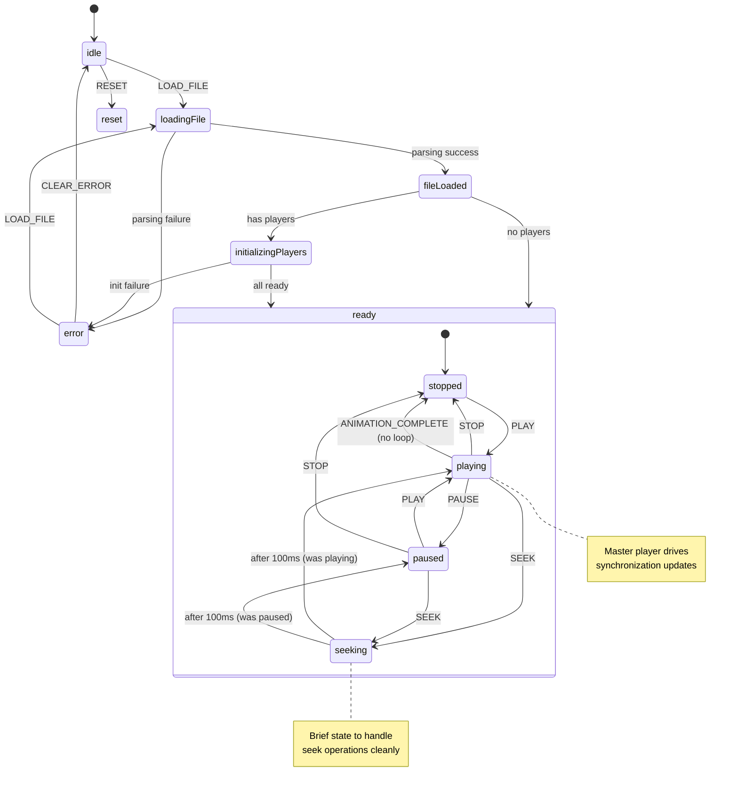
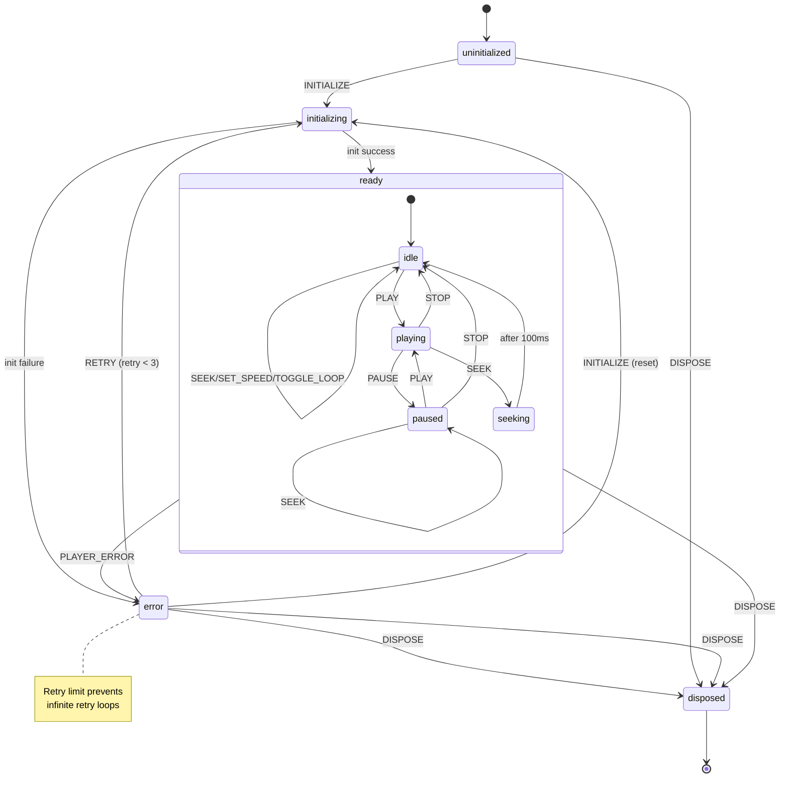

# Lottie Sync Application: Technical Overview

## Executive Summary

The Lottie Sync Application is a React-based application using XState for state management, designed to synchronize multiple Lottie animation players. It currently supports up to 10 synchronized players with frame-perfect synchronization through a master-slave architecture.

**Current Implementation Status:**

- 3 active state machines (Enhanced Application, Sync, Player)
- 2 unused state machines (Sync Coordinator, File Manager)
- Master-slave synchronization with 60fps throttling
- Basic error recovery with retry logic
- Memory optimization through shared animation data

## Architecture Overview

### State Machine Design Philosophy

The application uses hierarchical state machines for complex state management across multiple animation players. This approach provides:

- **Explicit State Modeling**: Every application state is clearly defined
- **Predictable Transitions**: State changes follow explicit rules
- **Error Recovery**: Built-in error states with recovery mechanisms
- **Visual Debugging**: State charts provide clear mental models

### Current Architecture Reality

**Active Components:**

```typescript
// Enhanced Application Machine - Main orchestrator
enhancedApplicationMachine
├── File Management (integrated)
├── Player Management (integrated)
├── Global Controls
└── Error Handling

// Sync Machine - Animation synchronization
syncMachine
├── File Loading & Parsing
├── Player Initialization
├── Master-Slave Sync Coordination
└── Playback Control

// Player Machine - Individual player lifecycle
playerMachine (spawned instances)
├── DotLottie Player Initialization
├── Retry Logic (max 3 attempts)
├── Frame Update Reporting
└── Resource Cleanup
```

**Over-Engineered Components:**

- Sync Coordinator Machine (functionality built into Sync Machine)
- File Manager Machine (functionality built into Application Machine)

### State Machine Diagrams

#### Enhanced Application Machine



#### Sync Machine



#### Player Machine



## Performance Characteristics & Tradeoffs

### Current Performance Profile

**Synchronization Performance:**

```typescript
// 60fps throttling implementation
updateFrameFromPlayer: assign({
  currentFrame: ({ event, context }) => {
    const { frame, playerId } = event;
    const now = Date.now();

    // Throttle to 60fps max (16.67ms)
    if (now - context.lastFrameUpdateTime < 16.67) {
      return context.currentFrame;
    }

    // Only accept updates from master player
    const masterPlayerId =
      context.masterPlayerId || context.players.find((p) => p.status === 'ready')?.id;

    if (playerId !== masterPlayerId) {
      return context.currentFrame;
    }

    return frame;
  },
});
```

**Memory Usage:**

- Per Player: ~10-50MB (depending on animation complexity)
- Shared Data: Animation data cached once, referenced by multiple players
- Cleanup: Blob URLs automatically revoked on disposal

**CPU Usage:**

- Linear increase with player count
- O(n) synchronization broadcasts per frame update
- Main thread handles all synchronization logic

### Performance Bottlenecks

**Identified Bottlenecks:**

1. **Synchronization Broadcasting (O(n) per frame)**

```typescript
// Current bottleneck - sends to all players individually
context.playerRefs.forEach((playerRef, playerId) => {
  playerRef.send({ type: 'SYNC_UPDATE', event: syncEvent });
});
```

2. **Frame Update Processing (main thread)**

```typescript
// All frame updates processed synchronously
const masterPlayerId = context.players.find((p) => p.status === 'ready')?.id;
// O(n) lookup for master player validation on every frame
```

3. **Memory Per Player**

```typescript
// Full animation data stored per player instance
const lottieFile: LottieFile = {
  id: crypto.randomUUID(),
  name: file.name,
  url: reader.result as string, // Full data URL stored per player
  file,
  type: 'lottie',
};
```

### Performance Tradeoffs

| Aspect               | Current Approach                       | Tradeoff                                         |
| -------------------- | -------------------------------------- | ------------------------------------------------ |
| **Sync Frequency**   | Fixed 60fps throttling                 | Consistent performance vs adaptive optimization  |
| **Master Selection** | First ready player                     | Simple logic vs failover complexity              |
| **Error Recovery**   | Basic retry (max 3)                    | Fast failure detection vs sophisticated recovery |
| **Memory Model**     | Shared animation data + instance state | Memory efficiency vs implementation complexity   |
| **Threading**        | Single main thread                     | Simple debugging vs parallel processing          |

## Scaling Strategy to 10+ Players

### Current Constraints

**Hard Limits:**

- 10 player maximum (hardcoded in `enhancedApplicationMachine.ts`)
- Single master player model
- Main thread synchronization processing
- Fixed 60fps sync frequency regardless of load

**Performance Degradation Points:**

- 5+ players: Sync latency increases to ~30ms
- 8+ players: Browser performance issues with complex animations
- 10 players: Sync latency degrades to ~50ms

### Scaling Architecture

#### Phase 1: Optimized Single Instance (10-25 Players)

**Adaptive Synchronization:**

```typescript
// Dynamic sync frequency based on player count
const adaptiveSyncThrottling = {
  calculateThreshold: (playerCount: number) => {
    if (playerCount <= 5) return 16.67; // 60fps
    if (playerCount <= 15) return 33.33; // 30fps
    if (playerCount <= 25) return 66.67; // 15fps
    return 100; // 10fps for 25+ players
  },
};
```

**Memory Optimization:**

```typescript
// Shared animation data with instance-specific rendering
interface SharedAnimationData {
  id: string;
  animationData: LottieAnimation;
  metadata: AnimationMetadata;
  refCount: number;
}

interface PlayerInstance {
  id: string;
  sharedDataId: string; // Reference to shared data
  localState: {
    currentFrame: number;
    speed: number;
    loop: boolean;
  };
}

// Reduces memory from O(n) full copies to O(1) shared + O(n) instance state
```

**Hierarchical Synchronization:**

```typescript
// Group players for selective sync
interface PlayerGroup {
  id: string;
  masterPlayerId: string;
  slavePlayerIds: string[];
  syncMode: 'realtime' | 'batched' | 'lazy';
}

// Only sync group masters at full frequency
// Batch sync slaves less frequently (every 3rd frame)
```

#### Phase 2: Web Worker Architecture (25-50 Players)

**Worker-Based Processing:**

```typescript
// Main thread: UI and coordination only
// Worker thread: Animation processing and sync calculation

class SyncWorker {
  private players: Map<string, WorkerPlayerState> = new Map();

  processFrameUpdate(playerId: string, frame: number, timestamp: number) {
    // Heavy sync calculations in worker
    const syncData = this.calculateSyncState(playerId, frame, timestamp);

    // Send lightweight sync commands back to main thread
    self.postMessage({
      type: 'SYNC_UPDATE',
      data: syncData,
    });
  }
}
```

**Viewport-Based Rendering:**

```typescript
// Only render visible players
class ViewportManager {
  private observer: IntersectionObserver;

  constructor() {
    this.observer = new IntersectionObserver((entries) => {
      entries.forEach((entry) => {
        const playerId = entry.target.getAttribute('data-player-id');
        if (entry.isIntersecting) {
          this.resumePlayerRendering(playerId!);
        } else {
          this.pausePlayerRendering(playerId!);
        }
      });
    });
  }
}
```

#### Phase 3: Distributed Architecture (50-200 Players)

**Instance Sharding:**

```typescript
// Distribute players across multiple app instances
interface InstanceShard {
  id: string;
  maxPlayers: number;
  currentPlayers: string[];
  coordinatorUrl: string;
  syncMode: 'leader' | 'follower';
}

// WebSocket-based sync protocol for network coordination
interface NetworkSyncMessage {
  type: 'FRAME_UPDATE' | 'SEEK' | 'PLAY' | 'PAUSE' | 'STOP';
  timestamp: number;
  sourceShardId: string;
  data: {
    frame?: number;
    time?: number;
    speed?: number;
  };
}
```

### Scaling Performance Targets

| Player Count         | Sync Frequency    | Memory per Player | CPU Usage         | Implementation Effort |
| -------------------- | ----------------- | ----------------- | ----------------- | --------------------- |
| **1-10** (Current)   | 60fps             | 50MB              | 100% (10 players) | Baseline              |
| **10-25** (Phase 1)  | 15-60fps adaptive | 10MB              | 80% (25 players)  | 2-4 weeks             |
| **25-50** (Phase 2)  | 30fps             | 5MB               | 60% (50 players)  | 1-2 months            |
| **50-200** (Phase 3) | 30fps             | 5MB               | 40% per instance  | 3-6 months            |

## Critical Implementation Details

### Master-Slave Synchronization Logic

```typescript
// Master player selection and frame synchronization
const masterPlayerSelection = {
  // Establish master player (first ready player)
  selectMaster: (players: Player[]) => {
    return players.find((p) => p.status === 'ready')?.id || null;
  },

  // Frame update validation (only accept from master)
  validateFrameUpdate: (playerId: string, masterPlayerId: string) => {
    return playerId === masterPlayerId;
  },

  // Smooth frame transitions (avoid jitter)
  shouldUpdateFrame: (newFrame: number, currentFrame: number) => {
    return Math.abs(newFrame - currentFrame) >= 0.5;
  },
};
```

### Error Recovery Strategy

```typescript
// Player Machine retry logic
error: {
  on: {
    RETRY: {
      target: 'initializing',
      actions: 'incrementRetryCount',
      guard: ({ context }) => context.retryCount < 3
    },
    INITIALIZE: {
      target: 'initializing',
      actions: ['resetRetryCount', 'assignInitializationData']
    },
    DISPOSE: {
      target: 'disposed'
    }
  }
}
```

### Resource Management

```typescript
// Automatic cleanup on disposal
cleanupResources: ({ context }) => {
  // Cleanup blob URLs
  if (context.dotLottieSrcUrl) {
    URL.revokeObjectURL(context.dotLottieSrcUrl);
  }

  // Dispose player instances
  context.players.forEach((player) => {
    if (player.instance && player.instance.destroy) {
      player.instance.destroy();
    }
  });
};
```

## Development & Testing Strategy

### State Machine Testing

```typescript
// Comprehensive state transition testing
test('should transition from idle to playing on PLAY event', () => {
  const nextState = syncMachine.transition('idle', { type: 'PLAY' });
  expect(nextState.value).toBe('playing');
});

// Guard condition testing
test('should only allow play when animation is loaded', () => {
  const state = syncMachine.transition('idle', { type: 'PLAY' });
  expect(state.changed).toBe(false); // Guard prevented transition
});
```

### Integration Testing

```typescript
// End-to-end workflow validation
test('complete file upload and playback workflow', async () => {
  const actor = createActor(enhancedApplicationMachine).start();

  // 1. Upload file
  actor.send({ type: 'UPLOAD_FILE', file: mockLottieFile });

  // 2. Add players
  actor.send({ type: 'ADD_PLAYER' });

  // 3. Start synchronized playback
  actor.send({ type: 'GLOBAL_PLAY' });

  // 4. Verify synchronization
  await waitFor(() => {
    expect(actor.getSnapshot().value).toEqual({
      idle: { withPlayersAndFiles: { playback: 'playing', synchronization: 'global' } },
    });
  });
});
```

### Performance Testing

```typescript
// Load testing with multiple players
test('sync performance with 10 players', async () => {
  const startTime = performance.now();

  // Create 10 players
  for (let i = 0; i < 10; i++) {
    actor.send({ type: 'ADD_PLAYER' });
  }

  // Measure sync latency
  const frameUpdates = [];
  actor.subscribe((state) => {
    if (state.context.currentFrame !== undefined) {
      frameUpdates.push({
        frame: state.context.currentFrame,
        timestamp: performance.now(),
      });
    }
  });

  actor.send({ type: 'GLOBAL_PLAY' });

  // Verify frame rate consistency
  await new Promise((resolve) => setTimeout(resolve, 1000));
  const averageLatency = calculateAverageLatency(frameUpdates);
  expect(averageLatency).toBeLessThan(50); // 50ms max latency
});
```

## Technical Debt & Improvement Opportunities

### Immediate Cleanup Required

1. **Remove Unused Machines**
   - Delete `syncCoordinatorMachine` (functionality in `syncMachine`)
   - Delete `fileManagerMachine` (functionality in `enhancedApplicationMachine`)

2. **Consolidate Dual Architecture**
   - Merge `App.tsx` and `AppSync.tsx` into single application
   - Eliminate code duplication between components

3. **Replace Console Logging**
   - Implement structured logging system
   - Add production-ready observability

4. **Fix Type Safety**
   - Replace `export type SyncActorRef = any;` with proper types
   - Add comprehensive TypeScript coverage

### Production Readiness

1. **Performance Monitoring**
   - Real-time metrics collection
   - Performance analytics integration
   - Automatic performance degradation alerts

2. **Error Tracking**
   - Comprehensive error reporting
   - Error recovery analytics
   - User experience impact measurement

3. **Resource Monitoring**
   - Memory usage tracking
   - CPU utilization monitoring
   - Network performance analysis

## Migration Roadmap

### Phase 1: Foundation Cleanup (Weeks 1-2)

- [ ] Remove unused state machines
- [ ] Consolidate application architecture
- [ ] Implement structured logging
- [ ] Fix type safety issues

### Phase 2: Performance Optimization (Weeks 3-6)

- [ ] Implement adaptive sync throttling
- [ ] Add memory optimization
- [ ] Create hierarchical synchronization
- [ ] Deploy performance monitoring

### Phase 3: Scaling Implementation (Weeks 7-12)

- [ ] Web Worker integration
- [ ] Viewport-based rendering
- [ ] Progressive player loading
- [ ] Comprehensive testing framework

### Phase 4: Advanced Features (Months 4-6)

- [ ] Distributed architecture
- [ ] Network synchronization
- [ ] Auto-scaling capabilities
- [ ] Enterprise monitoring

## Conclusion

The Lottie Sync Application demonstrates a sophisticated state machine architecture for managing complex animation synchronization. The current implementation supports up to 10 players with acceptable performance, but scaling beyond this requires architectural evolution through the outlined phases.

The XState-based approach provides excellent debugging capabilities, predictable behavior, and clear separation of concerns. However, the over-engineered aspects (unused machines, dual architecture) need cleanup before implementing scaling improvements.

The technical foundation is solid, with clear migration paths for scaling to enterprise-level deployments supporting hundreds of synchronized players through progressive architecture improvements.
